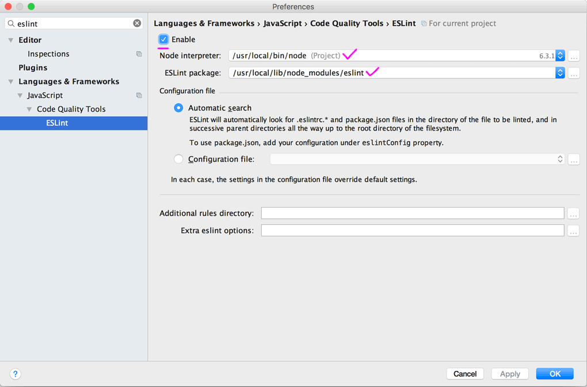

# Конфиги
MacOS по умолчанию не показывает файлы, название которых начинается с точки. Они считаются системными и прячутся от рядовых пользователей. Склонировав репозиторий вы их не увидите, хотя на самом деле они будут.

Увидеть их можно с помощью `ls -a` или [вот тут](http://ianlunn.co.uk/articles/quickly-showhide-hidden-files-mac-os-x-mavericks/) написано, как включить показ скрытых файлов в MacOS.

## Редактор
* [.editorconfig](.editorconfig) содержит настройки отступов, кодировки и переводов каретки для разных файлов. Чтобы он заработал, нужно установить в PHPStorm плагин [`EditorConfig`](https://plugins.jetbrains.com/plugin/7294). Так же имеются [плагины для других редакторов](http://editorconfig.org/#download).

## JS
### Линтер
Код проверяется с помощью ESLint в фоновом режиме в редакторе. ESLint использует файлы [.eslintrc.js](js/.eslintrc.js) для настроек проверки и [.eslintignore](js/.eslintignore) для игнорирования файлов, которые проверять не нужно.

Чтобы в редакторе заработала проверка на основе ESLint, нужно установить пакет (`npm i eslint -g`, можно глобально, использоваться будет везде) и в PHPStorm, включить соответствующую настройку:

ESLint может сам фиксить мелкие косяки (табы вместо пробелов, например). Для этого нужно запустить его с параметром `--fix`. Например, `eslint . --fix` исправит что сможет в файлах из текущего каталога.

### ES6
Предполагается, что файлы с кодом ES6 именуются так: `filename.babel.js`. Исходя из такого именования настраиваются отступы и прочие параметры.

[`.babelrc`](js/.babelrc) содержит настройки для транспайлера кода ES6 в ES5.

## LESS, CSS
Код проверяется с помощью [Stylelint](http://stylelint.io/) в фоновом режиме в редакторе. JetBrains поддерживают с версии `2016.3`.

Настройки хранятся в файле [`stylelint.config.js`](css/stylelint.config.js). Для игнорирования файлов можно создать `.stylelintignore`.

Для работы нужно установить `styleling` глобально и включить проверку в PHPStorm аналогично ESLint.
